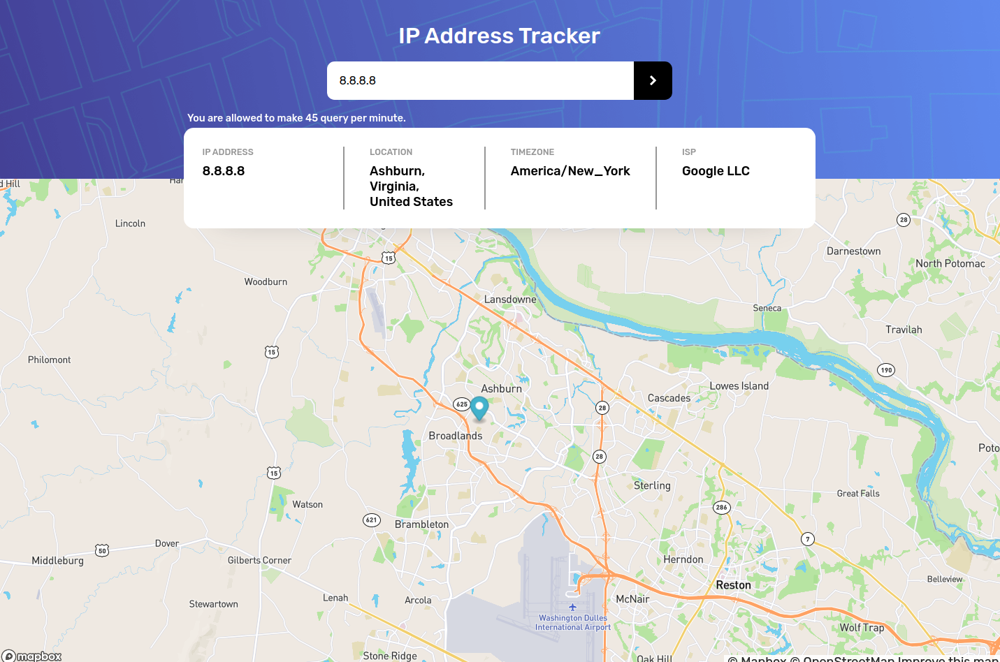
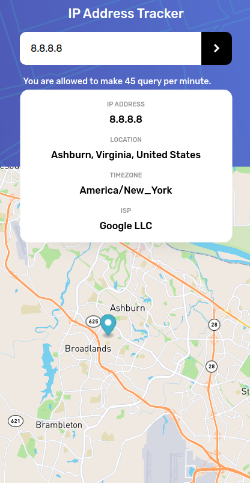

This is a solution to the [IP address tracker challenge on Frontend Mentor](https://www.frontendmentor.io/challenges/ip-address-tracker-I8-0yYAH0). Frontend Mentor challenges help you improve your coding skills by building realistic projects.

## Clone the project

`git clone https://github.com/Karunamay-murmu/IP-Address-Tracker.git`\
`cd IP-Address-Tracker`

Create `.env` file and put the appropriate token or api key. More info in `.env_sample` file.

`npm install`\
`npm start`

## How To Use IP Address Tracker?

- Enter an IP address or Domain name inside the input field
- Click the arrow button

## What informations you'll find?

You can see your IP details on initial page load.
- IP Address
- Your IP location
- Your timezone
- Your ISP

## Screenshot

### Desktop

### Mobile

## Built with

- React
- Scss
- Flexbox
- Grid
- Mobile-first workflow
- [IP-api](https://ip-api.com/)
